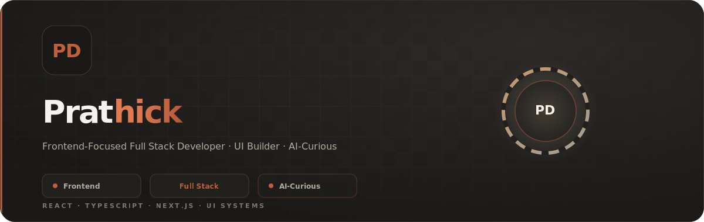

  

<h1 align="center">Hi 👋, I'm Prathick</h1>

  <b>Frontend-Focused Full Stack Developer</b> 
  UI Builder • AI-Curious

  

<h2 align="center">🚀 About Me (One-Liners)</h2>

  🛠 <b>Working on:</b> React + TypeScript • UI Components • Poll App  
  🤝 <b>Open to:</b> Frontend projects • SaaS ideas • UI/UX MVPs  
  🌱 <b>Learning:</b> Advanced JS • TS patterns • Clean React architecture  
  💬 <b>Ask me about:</b> React • UI systems • Gamification  
  ⚡ <b>Fun fact:</b> I redesign more than I release 😄

<h2 align="center">🌐 Connect With Me</h2>

<table align="center">
  <tr>
    <td align="center">
      
    </td>
    <td align="center">
      
    </td>
    <td align="center">
      
    </td>
    <td align="center">
      
    </td>
    <td align="center">
      
    </td>
  </tr>
</table>

<h2 align="center">💻 Tech Stack</h2>

<table align="center">
  <tr>
    <td align="center"></td>
    <td align="center"></td>
    <td align="center"></td>
    <td align="center"></td>
    <td align="center"></td>
    <td align="center"></td>
    <td align="center"></td>
    <td align="center"></td>
  </tr>

  <tr>
    <td align="center"></td>
    <td align="center"></td>
    <td align="center"></td>
    <td align="center"></td>
    <td align="center"></td>
    <td align="center"></td>
    <td align="center"></td>
    <td align="center"></td>
  </tr>
</table>

<h2 align="center">🐍 Contribution Game</h2>

  

<h2 align="center">📊 GitHub Activity</h2>

  

<table align="center">
  <tr>
    <td>
      

        🧠 Active contributor with consistent commits 
        🔁 Regularly building & refining projects 
        🚀 Focused on real-world, product-driven development
      

    </td>
    <td align="center" width="120">
      
    </td>
  </tr>
</table>

<h3 align="center">✍️ Random Dev Quote</h3>

  

  

